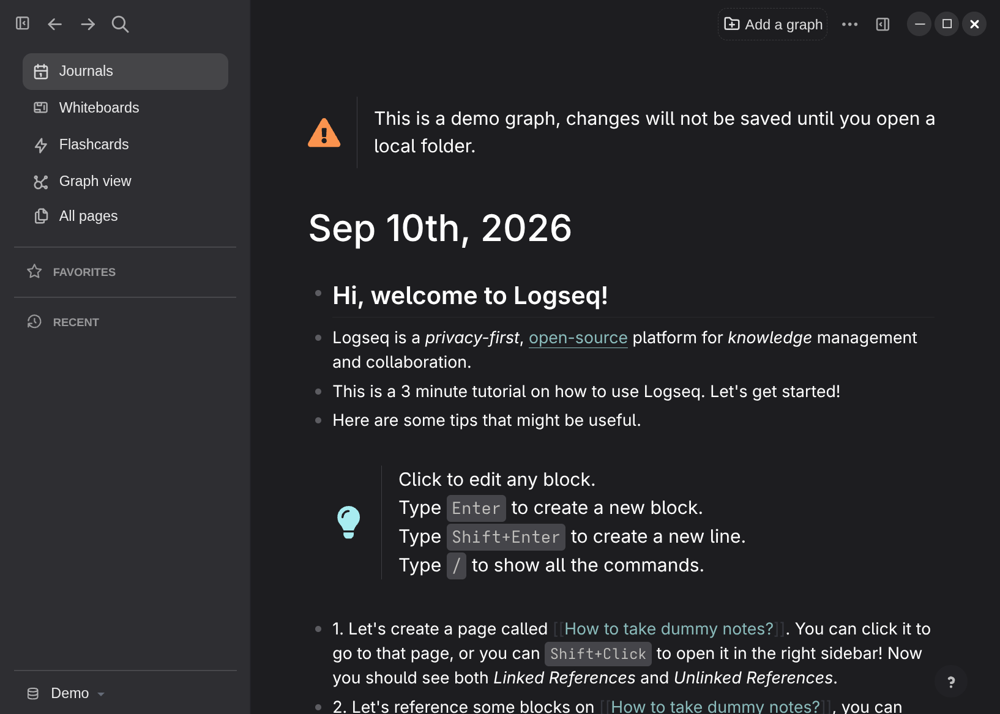
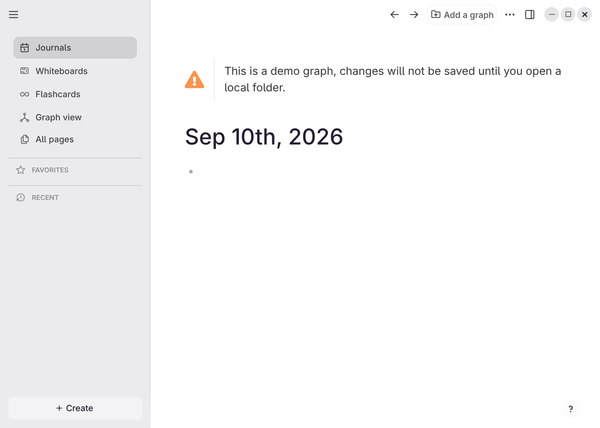

# Adwaita for Logseq

A theme plugin for Logseq on the **Linux GNOME desktop environment**: it makes Logseq look
like a native GNOME app — one merged headerbar, Adwaita surfaces, round window-control
buttons, GNOME's own metrics — in light and dark.





Every colour and measurement comes out of libadwaita itself rather than being sampled
from a screenshot:

```
gresource extract /usr/lib64/libadwaita-1.so.0 /org/gnome/Adwaita/styles/default.css
```

Window radius 15px, headerbar 47px, button and entry radius 9px, popover radius 12px;
surfaces `#1d1d20` / `#2e2e32` / `#36363a` on dark and `#ffffff` / `#ebebed` / `#fafafb`
on light; text at 80% opacity, borders at 15%, exactly as GNOME derives them.

## Install

Download the zip from the [latest release](https://github.com/CR0CKER/adwaita-for-logseq/releases/latest), unzip it, then in Logseq turn on
**Settings → Advanced → Developer mode** and use **Plugins → Load unpacked plugin** on the
unzipped folder. Then pick *Adwaita Dark* or *Adwaita Light* in **Settings → Themes**.

A Logseq marketplace listing has been submitted
([logseq/marketplace#898](https://github.com/logseq/marketplace/pull/898)) and is awaiting
review. Once it is merged, the theme installs from Logseq's own plugin marketplace; until
then, use the release zip above.

## Three things the stylesheet cannot do for you

CSS reaches the page, not the window. Without these the theme still applies, but it will
not look like the screenshots — and each one takes a few seconds:

**1. Turn the native title bar off.** Settings → General → *Native title bar* → off.
This is what gives Logseq a frameless window with the merged headerbar and the window
controls the theme styles. With it on, you get a GTK titlebar above a Logseq toolbar —
two bars where GNOME apps have one.

**2. Add the launch flags** to the `Exec=` line of your Logseq `.desktop` file. Copy it
into `~/.local/share/applications/` first, so a package update does not overwrite it; its
name depends on how Logseq was installed.

```
--enable-features=WaylandWindowDecorations,OverlayScrollbar --gtk-version=4
```

- `WaylandWindowDecorations` — Chromium draws the client-side frame of the frameless
  window: its shadow and resize edges, and rounded corners on Electron 43 or newer (see
  Scope). Without it the window has no frame at all.
- `OverlayScrollbar` — **the scrollbars come from this flag, not from the theme.**
  Logseq sets `scrollbar-color` on `:root`, and since Chromium 121 any specified
  `scrollbar-color` or `scrollbar-width` makes every `::-webkit-scrollbar*` rule inert —
  including `::-webkit-scrollbar-button { display: none }`. There is no CSS that removes
  the stepper arrows or reclaims the reserved gutter. With the flag you get real GTK-style
  overlay scrollbars: no buttons, no reserved width, fading out when idle. Without it,
  Chromium's classic scrollbars, tinted to match.
- `--gtk-version=4` — file dialogs render with GTK4/libadwaita.

**3. Select one of the two Adwaita themes** in Settings → Themes for the mode you use.
Logseq applies one theme per mode, so another theme selected there replaces this one.

## Settings

The plugin does two things: it registers the two themes (which on newer Logseq builds has
to happen in code — see *Why the themes are registered in code*), and it holds the handful of
choices that differ between machines. Settings → Plugins → **Gnome Adwaita Theme** → the
gear icon. (Its plugin id, which stored settings are keyed on, stays `gnome-adwaita-theme`.)

| Setting | Default | What it is for |
|---|---|---|
| Accent colour | `blue` | Which accent GNOME Settings is on. **CSS cannot read it** — Chromium's `AccentColor` resolves to its own generic blue, not GTK's — so it has to be told. The nine choices are libadwaita's own `@accent_bg_color` values. Set it to `follow Logseq` to hand control back to Logseq's own accent picker. |
| Custom accent (hex) | `#3584e4` | Used when the accent above is `custom`. Give the *fill* colour; the text accent is derived. |
| Accent lightness on dark (advanced) | `0.763` | The oklab lightness floor for accent text on dark. GNOME's own is 0.85; 0.763 is a notch darker and more saturated. |
| Window controls | `all` | Set to `close only` if your GNOME titlebar layout is `appmenu:close`. |
| Text colours | `GNOME apps (quiet)` | How colourful prose is. `Text Editor (Adwaita scheme)` colours headings teal, inline code violet and quote bars grey, as GNOME Text Editor does. Code blocks and highlights use the Adwaita scheme either way — see [Text colours](#text-colours). |
| Hide the right sidebar's top bar | off | Leaves one continuous headerbar. |
| Interface / monospace font | Adwaita Sans / Adwaita Mono | Adwaita Sans ships with GNOME 47+; Cantarell is the fallback. |

### How the accent works

Both pickers work, and which one wins depends on whether you have actually chosen an
accent in Logseq:

| Logseq's Settings → Accent color | What you get |
|---|---|
| its default (the turquoise "logseq" swatch), or none | the plugin's **Accent colour** |
| any other accent — purple, orange, teal… | that accent |

Logseq is not accent-less out of the box: it ships with `data-color="logseq"` already set.
Treating that as "unset" is what lets the plugin's setting mean anything on a fresh
install, while still yielding the moment you pick something deliberately. Set the plugin's
Accent colour to **follow Logseq** to let the turquoise default win too.

From whichever accent wins, the theme derives the same three values libadwaita does: the
standalone accent for text (`oklab(from accent max(l, 0.763) a b)` on dark, `min(l, 0.5)`
on light), the fill below it, and a hover step above. Links, tags, refs, task markers
(TODO, DOING, LATER, NOW…), selection, the focus ring and checkboxes all follow. Task
markers are drawn at full strength rather than Logseq's 70% opacity, which would take
every accent below WCAG AA at the markers' small size.

The surfaces never do. Logseq normally re-tints its whole neutral ramp along with the
accent, which turns linked-reference and quote cards warm; the theme puts the greys back —
verified `#2e2e32` under the default, purple and orange alike.

### Text colours

GNOME ships exactly one role-based palette for text: GtkSourceView's **Adwaita** style
scheme (`Adwaita` / `Adwaita-dark` in `libgtksourceview-5`), the default in GNOME Text
Editor and Builder. The [HIG palette](https://developer.gnome.org/hig/reference/palette.html)
is, in its own words, "intended for use in app icons and illustrations", and libadwaita
colours UI text only with the accent and the success/warning/error colours. The theme
follows that split:

| In your notes | Colour | From |
|---|---|---|
| Code blocks | keywords orange (bold), strings/types teal, functions blue, numbers violet, comments grey, on an Adwaita surface | the Adwaita scheme — replaces Logseq's solarized code theme |
| `==highlights==` | yellow, dark text | the scheme's search-match colours |
| Links, page refs, tags, block refs, task markers | the accent | libadwaita: navigation is accent-coloured |
| Headings, inline code, quote bars | body text (default) — or teal, violet and grey with **Text colours: Text Editor** | the scheme's `def:heading`, `def:inline-code`, blockquote marker |
| Page titles and journal dates | a soft grey under either setting: `#c0bfbc` on dark, `#3d3846` on light | the scheme's body-text colour (`text`, `light_5` on dark) |

No scheme colour is copied verbatim. Text Editor dims its body text and has one surface;
Logseq has several, and on them the scheme's own values fail WCAG AA (violet inline code
3.77:1 on its fill, grey comments 2.79:1, light teal headings 3.43:1). Each hue therefore
goes through the same lightness clamp libadwaita applies to accent text — lighter on dark,
darker on light — which keeps the hue and clears 4.5:1 on every surface it can sit on; the
static suite measures each one. Two deliberate departures from the scheme: the dark
highlight uses the scheme's black (`dark_7`) instead of its `dark_5`, which reaches only
3.54:1 on the translucent yellow, and light inline code is clamped one step darker than
accent text (0.48, not 0.5) to clear AA on the fill inside the sidebar.

Known gap: inline code *inside* a highlight (`` ==`code`== ``) keeps Logseq's own pale yellow
and dark text — Logseq sets that pair with `!important`, and the theme does not fight
`!important` in content.

## Troubleshooting

**A change or an update does not show.** Logseq reads the theme's stylesheet when the
theme is selected and the plugin's `package.json` when the plugin loads — not on every
change. Re-select *Adwaita Dark* / *Adwaita Light* in Settings → Themes; for a new plugin
title or a new setting, turn the plugin off and on in Settings → Plugins, or restart
Logseq.

**The sidebar or buttons look different from the screenshots** — grey text, other
spacing. Another styling plugin is overriding the theme: plugins that restyle Logseq's
chrome load after it and win. **Awesome UI** (`logseq-awesome-ui`) is a confirmed case —
it kept sidebar text and buttons grey over the theme's. Turn it off, or its conflicting
options; the theme covers the GNOME look on its own.

**One thing (say, the quote bar) ignores the theme.** Check the graph's
`logseq/custom.css`: a hand-written theme left there from before — an older Adwaita
`custom.css` did exactly this — overrides rules at equal specificity. Emptying it hands
the look back to the plugin.

**"Text colours: Text Editor" seems to change nothing.** It recolours only headings inside
notes, inline code and quote bars, as Text Editor does; a page with none of those looks
the same under both settings. Code blocks and highlights use the Adwaita scheme either way.

## Scope

- **Linux/GNOME**, light and dark. It will apply anywhere, but the point of it is the
  match with Adwaita.
- Verified by an automated suite that drives the real app and asserts computed styles:

  | Build | Status |
  |---|---|
  | **Logseq OG** (Electron 43) | every live case passes, with the screen unlocked (see [Tests](#tests)) |
  | **Logseq 2.x** (2.0.1, DB build) | all cases passed except the search dialog and divider cases, which skip because the harness cannot yet open a graph in a fresh 2.x profile. The task-marker and text-colour cases came later and have not run on 2.x; whether its code blocks use CodeMirror, as OG's do, is unverified |
  | **Logseq 0.10.13** | stylesheet verified by CDP probe; not in the live suite, because its renderer aborts unprompted on the development machine |

  Logseq 2.x's `--ls-*` palette is a strict subset of OG's, so the theme's variable
  coverage applies there unchanged.
- Three rules target components 0.10.13 does not have (`.ui__dialog-content`,
  `.ui__popover-content`, `.cm-editor`); they simply do not match there, and
  `.ui__modal-panel` and `.CodeMirror` cover the same ground.
- **Round window corners need Electron 43 or newer.** The frame is painted by Electron
  outside the web contents, so no stylesheet can reach it. Electron 41 gave frameless
  windows client-side decorations on Wayland — a shadow and resize edges — but rounded
  corners only arrived in
  [Electron 43.0.0](https://releases.electronjs.org/release/v43.0.0) ("On Linux,
  frameless windows now have rounded corners by default"). Logseq OG is on 43 and gets
  them; Logseq 2.0.1 is on Electron 42.3.0 and has square corners until Logseq ships a
  newer Electron.

## Development

```
npm install
npm run build     # concatenates src/css/* into themes/adwaita.css, bundles the plugin
npm test          # static regression suite (this is what CI runs)
npm run test:live # drives real Logseq builds — local only, needs a binary
```

To try a change, turn on Logseq → Settings → Advanced → Developer mode and use **Load
unpacked plugin** on the repo directory. The two themes appear in Settings → Themes like
any installed theme.

Logseq then runs whatever is checked out in that directory. After `npm run build`,
re-select the theme (and toggle the plugin for `package.json` or settings changes). And
since switching branches swaps the stylesheet under a running Logseq — while the ignored
`dist/` build stays behind, so a setting can appear with no rules behind it — do side work
in a `git worktree` rather than by switching branches in the directory Logseq loads.

`src/css/` is split so a colour is written down in exactly one place:

| File | |
|---|---|
| `10-tokens-dark.css` | the dark palette, from libadwaita |
| `15-tokens-light.css` | the light palette, from libadwaita |
| `20-mappings.css` | Logseq's `--ls-*`, the shui `--lx-gray-*` ramp and the shadcn HSL triplets, all pointed at those tokens — colour-scheme independent |
| `25-accent.css` | accent derivation and the neutral-ramp restatement |
| `27-text.css` | text colours inside notes: the Adwaita scheme's hues through the accent clamp, code blocks, highlights, and the prose roles the Text colours setting switches |
| `30-structure.css` | headerbar, sidebar, window controls, widgets, content — geometry only, every colour a token |

The structure rules are scoped `html[data-theme]`, not `html[data-theme="dark"]`, so one
sheet serves both schemes and the palette files are the only difference between them.

### Tests

Two tiers, because CI cannot run the app and text-matching a stylesheet cannot prove a
cascade rule *wins* — and most of the bugs this suite locks down were cascade bugs.

**Static (`npm test`, the CI gate).** Every `--ls-*` in Logseq's shipped solarized palette
is overridden or allowlisted with a reason; no undefined `--adw-*` reference; the
structure and text sheets stay scheme-agnostic and free of literal colours; every
`[data-color]` specificity tie is present; all nine accents clear WCAG AA on both surfaces
in both schemes, as text and as task markers at the opacity they render with; every
Adwaita-scheme text colour clears AA once clamped, inline code on its fill too, and so
does highlight text on its highlight; every code token Logseq colours is re-pointed; the
settings logic behaves; and `themes/adwaita.css` matches a fresh build.

**Live (`npm run test:live`, local only).** Launches a scratch instance with an isolated
`HOME`, loads this repo as an unpacked plugin, selects the theme and asserts computed
styles: stored settings winning over the theme sheet, surfaces, light/dark inversion,
accent precedence, the search dialog's edges, divider geometry, sidebar section headers,
button hover colour, accent contrast, task markers (accent colour, full opacity, the
accent hover step on hover), and text colours (code-block surface and tokens, highlights,
and headings / inline code / quote bars under the "Text Editor" setting the harness seeds),
and that no visible text or icon in the headerbar or sidebar is anything but the full
foreground, with sidebar row icons dimmed to Files' 0.7.

```
npm run test:live -- --target=og      # one target
LOGSEQ_OG_BIN=/path/to/Logseq-OG npm run test:live
LOGSEQ_DB_BIN=/path/to/logseq npm run test:live -- --target=db
```

A target whose binary is missing is skipped with a reason, never silently passed.

Run it with the screen **unlocked**. A locked session stops the compositor painting the
scratch window, so `requestAnimationFrame` never fires and Logseq stops re-rendering: the
light/dark switch times out ("the app never switched to light") and pages created through
the API never appear. The task-marker case detects this and skips; the others fail.

Known gap: `openGraph()` does not actually open the seeded graph on OG — the app stays on
its demo graph ([#2](https://github.com/CR0CKER/adwaita-for-logseq/issues/2)). The two
cases marked `needs: ['graph']` therefore run against the demo graph; they pass because it
carries the same sidebar and search UI, but the seeded journal content is never used.

**`./scripts/redcheck.sh`** proves the suite is not vacuous. Every assertion here was
written after its bug was already fixed, so the usual red-then-green order was impossible;
this script reconstructs the red half by putting the pre-fix code back — from git history,
or as a mutation in a scratch tree — and requires the matching test to fail.

**Fixtures are version-scoped.** `tests/fixtures/logseq-vars.<target>.json` is extracted
from one build's stylesheet, so a Logseq upgrade can introduce variables the theme does not
cover. Regenerate when testing a new version:

```
node scripts/extract-logseq-vars.mjs og /path/to/Logseq/resources/app/css/style.css
```

Logseq 2.x packs its stylesheet inside `app.asar`; dump it from a running instance first
with `node scripts/dump-app-css.mjs <devtools-port> /tmp/db-style.css`, then run the
extractor on that file.

### Releasing

A release is a pushed `v*` tag; `.github/workflows/publish.yml` builds the plugin, zips it
and attaches the zip **and** `package.json` to a GitHub Release (Logseq reads the latter for
the version and update checks). The marketplace manifest carries no version — it installs
the latest GitHub release — so a new release needs no marketplace PR.

```
npm version 0.1.2 --no-git-tag-version   # bumps package.json and package-lock.json together
# CHANGELOG: move [Unreleased] under a dated ## [0.1.2] heading, update the compare links
npm run build && npm test && ./scripts/redcheck.sh
npm run test:live -- --target=og         # screen unlocked
git commit -m "chore: prepare v0.1.2" CHANGELOG.md package.json package-lock.json
git tag -a v0.1.2 -m "Adwaita for Logseq 0.1.2"
git push origin master && git push origin v0.1.2
```

Then check the run went green and the release carries both assets:
`gh release view v0.1.2 --json assets`.

### Why the themes are registered in code, not in package.json

The conventional way to ship a theme is `logseq.themes` in package.json. Doing that makes
the host resolve the stylesheet to an `assets://` URL — which Logseq OG (Electron 43)
rewrites to `file://`, and a `file://` subresource of an `lsp://` document is blocked
outright:

```
Not allowed to load local resource: file:///…/themes/adwaita.css
```

The theme then shows up in the picker and silently does nothing. Official 0.10.13
(Electron 27) loads the same `assets://` URL fine, so this only bites on newer Electron —
but it bites both marketplace *and* unpacked installs there.

Registering at runtime with `logseq.provideTheme()` and
`logseq.resolveResourceFullUrl('themes/adwaita.css')` asks the SDK for the plugin's own
static root instead, which is the scheme the host actually serves: `lsp://logseq.io/<id>/…`
for an installed plugin, `lsp://logseq.com/external/<path>/…` for an unpacked one. Verified
on Logseq OG, installed and unpacked, and on Logseq 2.0.1 unpacked.

### Why some rules look over-specific

Logseq paints the same surface through four independent systems, and a theme has to cover
all of them:

1. `--ls-*` — the classic theme layer.
2. `--lx-gray-01..12` — the shui/radix ramp. Buttons, dropdowns, dialogs, cmdk and
   `.references-blocks-item` read *these*, not the `--ls-*` vars.
3. shadcn HSL triplets (`--primary`, `--popover`, `--ring`, …), consumed as
   `hsl(var(--primary))`. Untouched, every shui button stays a near-white pill.
4. Element-level overrides further down Logseq's own sheet.

Three traps are worth knowing before editing:

- `html[data-theme="dark"][data-color="<accent>"]` activates a full ~50-variable palette at
  specificity (0,2,1) — the solarized-ish `logseq` one is the **default on a fresh
  install** — which outranks a plain `html[data-theme="dark"]` block. Every token block
  here therefore carries a second `[data-color]` selector to tie that specificity and win
  on order.
- That palette spends its two subtlest accent steps (`--lx-accent-01`/`-02`) on chrome —
  button hovers, tooltip and dialog borders — so in it they are teal. The theme maps both to
  neutral Adwaita tokens; steps 03 and up keep the accent.
- The plugin's settings stylesheet cannot rely on load order: Logseq appends the theme's
  `<link>` whenever a theme is selected, after the settings `<style>`. The root-level
  overrides it shares with the theme are therefore `!important`, and a test requires it.

## Licence

MIT.
